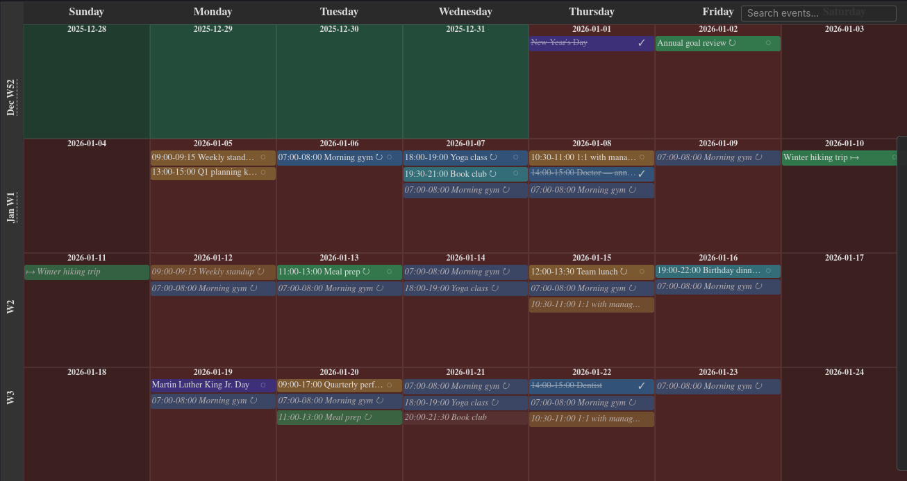

## Overview

A lightweight personal calendar served by a Go HTTP backend with a vanilla
JavaScript frontend. Events are stored as JSON and require no database. The
interface is designed around keyboard shortcuts for fast navigation, with four
view modes (calendar, day, week, and agenda), full iCal interoperability, and
support for complex recurring events with per-occurrence exceptions.

<p align="center">
  
</p>

## Features

- Four view modes: multi-week calendar, single day, week, and agenda
- Recurring events with daily, weekly, monthly, and yearly frequencies
- Per-occurrence exceptions: delete or edit a single instance of a recurring series
- Drag-and-drop to move events; Ctrl+drag to copy
- iCal (.ics) export and import with EXDATE and RECURRENCE-ID support
- JSON backup and restore
- Event categories with automatic color coding by hue
- Category autocomplete suggests existing categories while typing
- Full-text search across event title, category, and notes
- ISO week numbers in the side label with clickable mini-month navigation popup
- Single-level undo with Ctrl+Z
- Dark and light mode
- Debounced saves with a saving/saved indicator
- Right-click context menu on events (Edit / Duplicate / Delete)
- Print-friendly CSS
- Configurable week start (Sunday or Monday)
- URL tracks the current view and date for bookmarkable links
- Keyboard-driven navigation (see Usage)

## Usage

```
go run .
```

The server listens on port 8080 by default. Set the `PORT` environment variable
or pass `-port` to use a different port.

```
go run . -port 9000
```

### Keyboard shortcuts

## Dependencies

## License

This work is licensed under the GNU General Public License version 3 (GPLv3).

[](https://www.gnu.org/licenses/gpl-3.0.en.html)
